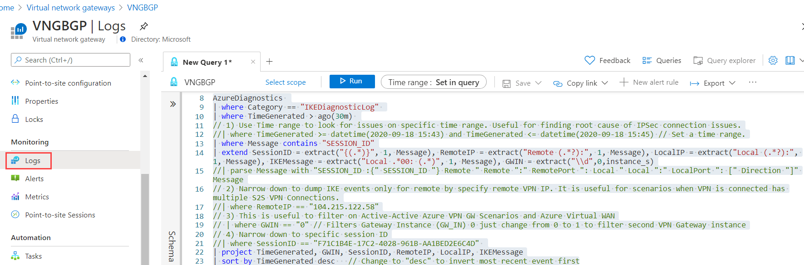
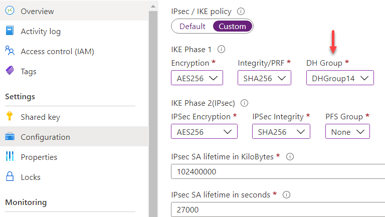

# Azure Virtual Network Gateway IKE Logs

# Contents

[Introduction](#introduction)
[Prerequisites](#prerequisites)
[IKE logs kusto query](#ike-logs-kusto-query)
[Examples](#examples)
[Identify IPSec Pre-Shared Key (PSK) mismatch issues](#identify-ipsec-pre-shared-key-psk-mismatch-issues)
[Identify IPSec Policy mismatch issues](#identify-ipsec-policy-mismatch-issues)

## Introduction

Getting visibility on Azure components is key to better understand how they work and helps on the troubleshooting process. Internet Key Exchange (IKE) is the protocol used to set up security association (SA) in the IPSec protocol suite. For a full IPSec tunnel to be established and maintained, IKE has to succeed in both Phase I (Main Mode) and Phase II (Quick Mode). Therefore, IKE Logs is key to troubleshoot VPN connectivity issues or IP tunnel disconnections. In this article we going to go over how to enable those IKEv2 logs as well as go over few common scenarios to help you troubleshoot connectivity issues.

## Prerequisites

To enable IKE Logs for Virtual Network Gateway you need to send the logs to a storage account, log analytics or event hub (3rd party logging applications). That can be done over Azure Monitor via PowerShell, CLI or Portal. Below is an on how to enable IKE Logs for Azure Virtual Network Gateway over Portal under Azure Monitor - Diagnostics - Select Resource Group and Virtual Network Gateway (also applicable for Azure Virtual WAN VPN Gateway):


For the scope of this article you have to select at least IKEDiagnosticLog.
More information on how to enable logs consult: [Diagnostic logs](https://docs.microsoft.com/en-us/azure/virtual-wan/logs-metrics#diagnostic).

:point_right: **Note**: It may take up to 15 minutes between when an event is emitted and when it appears in a Log Analytics workspace.

## IKE logs kusto query

Below is a IKE Kusto query that can help extract information from IKEDiagnosticLog in Log Analytics. By default that Kusto query will list IKE logs from the last 30 minutes.

*Note:* the same query has been uploaded to Azure Monitor Community repository under Virtual Network Gateway. Click [here](https://github.com/microsoft/AzureMonitorCommunity/blob/master/Azure%20Services/Virtual%20Network%20Gateways/Queries/Diagnostics/IKE%20log%20events.kql)

```kusto
AzureDiagnostics 
| where Category == "IKEDiagnosticLog" 
| where TimeGenerated > ago(30m) 
// 1) Use Time range to look for issues on specific time range. Useful for finding root cause of IPSec connection issues.
//| where TimeGenerated >= datetime(2020-09-18 15:43) and TimeGenerated <= datetime(2020-09-18 15:45) // Set a time range.
| where Message contains "SESSION_ID"
| extend SessionID = extract("{(.*)}", 1, Message), RemoteIP = extract("Remote (.*?):", 1, Message), LocalIP = extract("Local (.*?):", 1, Message), IKEMessage = extract("Local .*00: (.*)", 1, Message), GWIN = extract("\\d",0,instance_s)
//| parse Message with "SESSION_ID :{" SESSION_ID "} Remote " Remote ":" RemotePort ": Local " Local ":" LocalPort ": [" Direction "]" Message
// 2) Narrow down to dump IKE events only for remote by specify remote VPN IP. It is useful for scenarios when VPN is connected has multiple S2S VPN Connections.
//| where RemoteIP == "104.215.122.58"
// 3) This is useful to filter on Active-Active Azure VPN GW Scenarios and Azure Virtual WAN
// | where GWIN == "0" // Filters Gateway Instance (GW_IN) 0 just change from 0 to 1 to filter second VPN Gateway instance
// 4) Narrow down to specific session ID
//| where SessionID == "F71C1B4E-17C2-4028-961B-AA1BED2E6C4D" 
| project TimeGenerated, GWIN, SessionID, RemoteIP, LocalIP, IKEMessage
| sort by TimeGenerated asc    // Change to "desc" to invert most recent event first
```

However, there are some comments on the query below that can help you narrow down the issue. To leverage them just remove the comments (double bars //):

1) Use Time range to look for issues on specific time range. Useful for finding root cause of IPSec connection issues.
*| where TimeGenerated >= datetime(2020-09-18 15:43) and TimeGenerated <= datetime(2020-09-18 15:45) //* Set a time range.*

2) Narrow down to dump IKE events only for remote by specify remote VPN IP. It is useful for scenarios when VPN is connected has multiple S2S VPN Connections.
*| where RemoteIP == "104.215.122.58"*

3) This is useful to filter on Active-Active Azure VPN Gateway Scenarios and Azure Virtual WAN (by design uses two Active-Active Gateways)
*| where GWIN == "0" // Filters Gateway Instance (GW_IN) 0 just change from 0 to 1 to filter second VPN Gateway instance*

4) Narrow down to specific session ID
*| where SessionID == "F71C1B4E-17C2-4028-961B-AA1BED2E6C4D"*

## Examples

Below are examples on how to identify common VPN connection issues. You can try those before opening a Support Ticket. After enable VPN Gateway on diagnostics to Log Analytics your can use Virtual Network Gateway blade under Monitoring to run the query above.



On Virtual WAN VPN Gateways you need to open Logs inside Log Analytics workspace.

### Identify IPSec Pre-Shared Key (PSK) mismatch Issues

In the example below incorrect pre-shared key has been assigned in one the sides and here how to identify the issue. The query above got executed by changing only the last to: **| sort by TimeGenerated desc** to bring more recent events to the top.


Few points to keep in mind to assist you on the troubleshooting:

- [SEND][SA_INIT] - IKE SA has been initiated by Azure VNG Gateway (IKE INITIATOR)
- [LOCAL_MSG] - Azure VPN Gateway response for a configuration sent by remote VPN device.
- [RECEIVE] - Contains all information sent by the VPN device.

### Identify IPSec Policy mismatch issues

This is kind tricky to identify because you need to collect information from both sides to determine what is the specific setting causing Policy Mismatch. Because Azure can be the IKE INITIATOR you can extract all policy information as well as what remote VPN device is sending. Sometimes you need to force VPN connection from remote side to show it as IKE Initiator. Below is an example for a sequence where we have Azure as Initiator and remote VPN device as Initiator and we can see what is causing the Policy Mismatch.


On the screen above you can get full IPSec Policies from both and compare:

Azure VPN Gateway sends by default the following IPSec (Main mode/Phase I) policies:
- Policy1: Cipher=AES-CBC-256 Integrity=SHA1 DhGroup=DhGroup2
- Policy2: Cipher=AES-CBC-256 Integrity=SHA256 DhGroup=DhGroup2
- Policy3: Cipher=AES-CBC-128 Integrity=SHA1 DhGroup=DhGroup2
- Policy4: Cipher=AES-CBC-128 Integrity=SHA256 DhGroup=DhGroup2
- Policy5: Cipher=3DES Integrity=SHA1 DhGroup=DhGroup2
- Policy6: Cipher=3DES Integrity=SHA256 DhGroup=DhGroup2

More information about Azure Gateway IPSec policies consult: [IKE Phase 1 (Main Mode) parameters](https://docs.microsoft.com/en-us/azure/vpn-gateway/vpn-gateway-about-vpn-devices#ike-phase-1-main-mode-parameters). Also, you can validate what policies Azure VPN Gateway sends as [Initiator](https://docs.microsoft.com/en-us/azure/vpn-gateway/vpn-gateway-about-vpn-devices#azure-gateway-as-initiator) as well as what can accepts as [Receiver](https://docs.microsoft.com/en-us/azure/vpn-gateway/vpn-gateway-about-vpn-devices#azure-gateway-as-responder).

Remote VPN sends only a single IPsec policy:
- Policy1: Cipher=AES-CBC-256 Integrity=SHA256 DhGroup=**DhGroup14**

**Issue/Solution**: main issue is remote VPN device is sending Diffie-Hellman **Group 14** while Azure VPN Gateway expects only **Group 2**. You can resolve this issue by either changing remote VPN device to Group 2 or Group 14 on custom IPSec settings on Azure side to match exactly remote VPN device as shown:



## LAB
A lab with automated scenarios will be added soon. Stay tunned!
