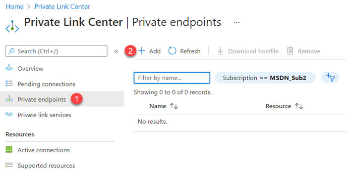
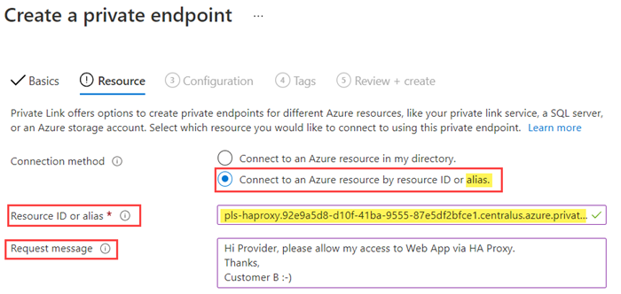
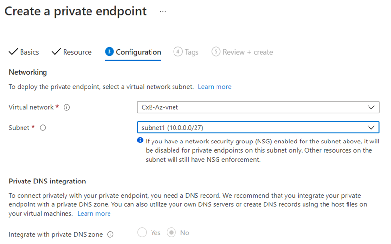
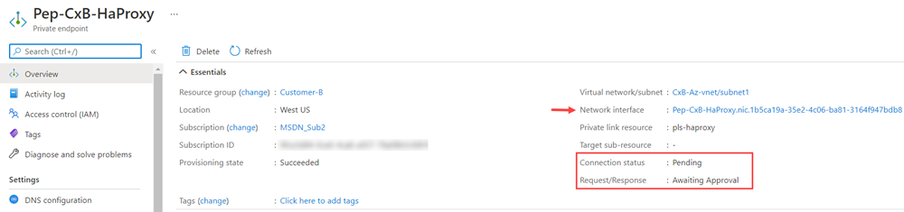
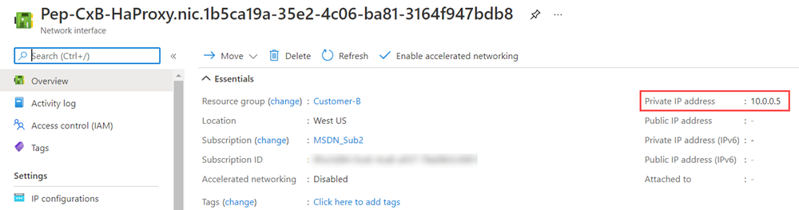
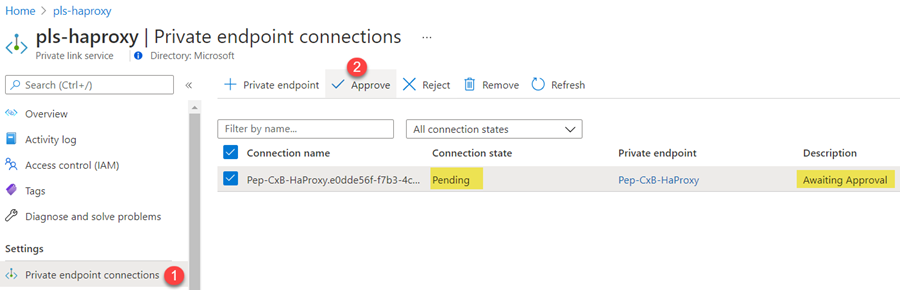
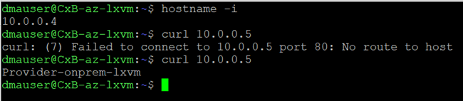

# Using Private Link Service to publish On-premises workloads by using NVA Firewall (TBD)

**Contents**

[Concepts](#Concepts)

[Deploy this solution](#Deploy-this-solution)

[LAB Steps](#LAB-Steps)

[Clean up](#Clean-up)

## Concepts

This lab is based on the reference architecture: [Using Private Link Service for On-premises workloads](https://github.com/dmauser/PrivateLink/tree/master/PLS-for-Onprem-workloads) and it leverages an opensource NVA Firewall behind an Azure Load Balancer and Private Link Service. This solution will fully build the solution on the Provider side as shown in the diagram below. 

Therefore, you don't need to configure any component like HAProxy, Load Balance, and Private Link Service. Most of the actions are going to be to expose On-premises web workload (On-prem VM name _provider-onprem-vmlx_ exposed using local's VM Nginx) by creating Private Endpoints on customer A and B and validating access via Private Link to reach the Provider's On-premises VM.

### Architecture diagram

Below some important details of each environment deployed:

### Provider

1. **Virtual networks**: provider-az-vnet (Azure - 192.168.0.0/24) and provider-onprem (emulated On-premises 192.168.0.0/24)
2. **Virtual Machines**: Provider-onprem-lxvm (with IP 192.168.1.4 and running Nginx) and Provider-az-lxvm (10.0.0.4).
3. **VM Scale Set**: pls-ha-proxy using two instances inside haproxy subnet.
4. **Internal load standard balancer** pls-std-ilb (10.0.0.132).
5. **Private Link Service**: pls-haproxy using 10.0.0.164 that is from subnet pls-nat-subnet.
6. **VPN Gateways and connection** between Azure and On-premises environment.

### Customer A and B

1. **Virtual networks**: Cx(A/B)-az-vnet (Azure - 192.168.0.0/24) and zcx(a/b)-onprem (emulated On-premises 192.168.0.0/24)
2. **Virtual Machines**: Cx(A/B)-onprem-lxvm (with IP 192.168.1.4 and running Nginx) and Cx(A/B)-az-lxvm (10.0.0.4).
3. VPN Gateways and connection between Azure and On-premises environment.

**Note:** All three environments use the same address space which is another benefit of Private Link Service that has built-in SNAT. Also, you can deploy each environment in different regions. As shown in the diagram above where you Provider on US Central, Customer A on East US, and Customer B on West US.

## Deploy this solution

**Note:** The template provisioning takes approximately 25-30 minutes to complete the Provider environment and 20 minutes for each Customer environment.

Deploy three separated environments for Provider, Customer A and Customer B using the same link by:

1. Selecting each one of the respective environments:

    

2. Set your username and password (SSH public key option coming soon).

3. (Optional) set Public IP to restrict SSH access only using your public IP (obtain your public IP by using command curl -4 ifconfig.io). You have to specify public IP plus CIDR, example 1.1.1.1/32.

    

## LAB Steps

**Goal:** Allow customers A and B access Provider's On-premises web workload.

Use the steps below using Azure Portal. You need to go back and forth between Provider and Customers A and B.

1. On the Provider side obtain the Private Link Service (PLS) alias.

    

2. On Customer (A and B) side deploy Private Endpoints using Private Link Center, selecting Private endpoints (1) and adding a new one (2).

    

3. Follow the wizard and make sure to paste the PLS alias from step 1.

    

4. Place the private endpoint on Cx(A/B)-az-vnet on Subnet1 as shown:

    

5. Review the Private endpoint on the Customer side and note that it is waiting for approval and has IP 10.0.0.5 allocated by clicking on the NIC.

    

    

6. At this point, if you try to connect over that Private endpoint connection should fail. You can try a curl 10.0.0.5 on either Cx(A/B)-onprem-lxvm (192.168.1.4 and running Nginx) and Cx(A/B)-az-lxvm (10.0.0.4).

7. Approve Private Link connection on Provider side over pls-proxy (private link service) as shown:

    

8. Try again Curl 10.0.0.5 and you should have the right output. Below curl output before approval (fail to connect) and after with provider-onprem-vmlx output:

    **CxB-az-lxvm**

    
    
    **CxB-onprem-lxvm**

    

9. Review Nginx access logs on Provider-onprem-vmlx. You should see the source IP of one of the HAProxy VMSS instances 10.0.0.135 and Private Link Service (pls-haproxy) NAT IP after enabling X-FORWARDED-FOR on Nginx configuration by using option 1 of this [reference guide](https://www.loadbalancer.org/blog/nginx-and-x-forwarded-for-header).

    

## Clean up

Delete Resource Groups for each one of the deployed environments.