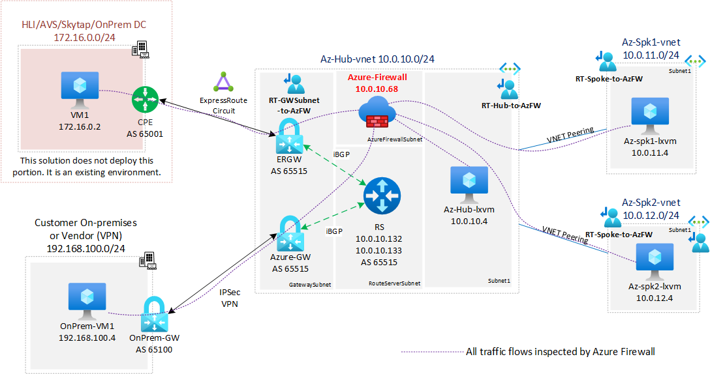

# Using Azure Firewall to inspect traffic between VPN and ExpressRoute

**Contents**

[Concepts](#Concepts)

[Deploy this solution](#Deploy-this-solution)

[LAB steps](#LAB-steps)

[Clean up](#Clean-up)

[Acknowledgments](#Acknowledgments)

## Concepts

This LAB is a continuation of the scenario of  [Transit between ExpressRoute and Azure S2S VPN using Route Server](https://github.com/dmauser/Lab/tree/master/RS-ER-VPN-Gateway-Transit) but adds Azure Firewall to allow traffic inspection between all ends: ExpressRoute, VPN, Hub and Spoke VNETs.

### Use Case

All customers that have business to business (B2B) with other companies can benefit from this scenario, whether as a consumer to other service providers/vendors or as providers allowing their customer access resources in Azure as well as On-premises.

This lab intends to help you to build a Lab environment to simulate transit between ExpressRoute and VPN by creating the environment integrally as well as emulate an on-premises environment to give you the capability to demonstrate and validate the transit functionality made possible by ARS. In addition, it adds Azure Firewall as a central security component for traffic inspection between VPN and ExpressRoute connections and workloads placed on the Spoke VNETs.

### Architecture diagram



## Deploy this solution

### Step 1 - Deploy base environment using the following ARM template
[](https://portal.azure.com/#create/Microsoft.Template/uri/https%3A%2F%2Fraw.githubusercontent.com%2Fdmauser%2FLab%2Fmaster%2FRS-ER-VPN-Gateway-Transit%2Fazuredeploy.json)
[](http://armviz.io/#/?load=https%3A%2F%2Fraw.githubusercontent.com%2Fdmauser%2FLab%2Fmaster%2FRS-ER-VPN-Gateway-Transit%2Fazuredeploy.json)

**Note:** The template provisioning takes approximately 40-50 minutes to complete.

### Step 2 - Deploy Azure Firewall and route tables (UDRs)

```bash
# Install required CLI extension
az extension list-available --output table
az extension add --name azure-firewall

#Variables
##Define your resource group
rg=RSLAB-ER-VPN-AZFW
##Set Region
location=$(az group show -g $rg --query location -o tsv)
## On-premises (AVS, HLI, Skytap) address space connected via ExpressRoute circuit.
EREnvironmentAddressSpace=172.16.0.0/24 

##Azure Hub Name
AzurehubName=Az-Hub
## Azure Hub VNET address space
AzurehubaddressSpacePrefix=$(az network vnet show -g $rg -n $AzurehubName-vnet --query "addressSpace.addressPrefixes" -o tsv)
##Azure Hub Subnet address prefix
Azurehubsubnet1Prefix=$(az network vnet subnet show -g $rg -n subnet1 --vnet-name $AzurehubName-vnet --query addressPrefix -o tsv)
## Azure Hub Firewall Subnet address prefix
AzurehubFirewallPrefix=$(az network vnet subnet show -g $rg -n AzureFirewallSubnet --vnet-name $AzurehubName-vnet --query addressPrefix -o tsv) 
##Azure Spoke 1 name
Azurespoke1Name=Az-Spk1
## Azure Spoke 1 VNET address space
Azurespoke1AddressSpacePrefix=$(az network vnet show -g $rg -n $Azurespoke1Name-vnet --query "addressSpace.addressPrefixes" -o tsv) 
##Azure Spoke 2 name
Azurespoke2Name=Az-Spk2
## Azure Spoke 2 VNET address space
Azurespoke2AddressSpacePrefix=$(az network vnet show -g $rg -n $Azurespoke2Name-vnet --query "addressSpace.addressPrefixes" -o tsv)
#On-premises Name
OnPremName=OnPrem
#On-premises VPN VNET address space
OnPremVnetAddressSpace=$(az network vnet show -g $rg -n $OnPremName-vnet --query "addressSpace.addressPrefixes" -o tsv)

## Log Analytics workspace name. 
Workspacename=$AzurehubName-Firewall-Logs 

#Build Azure Firewall / Note this section takes few minutes to complete.
az network public-ip create --name $AzurehubName-azfw-pip --resource-group $rg --location $location --allocation-method static --sku standard
az network firewall create --name $AzurehubName-azfw --resource-group $rg --location $location
az network firewall ip-config create --firewall-name $AzurehubName-azfw --name FW-config --public-ip-address $AzurehubName-azfw-pip  --resource-group $rg --vnet-name $AzurehubName-vnet
az network firewall update --name $AzurehubName-azfw --resource-group $rg 

#Create firewall rule to allow all traffic
az network firewall network-rule create --resource-group $rg \
--firewall-name $AzurehubName-azfw \
--collection-name azfw-rules \
--priority 1000 \
--action Allow \
--name Allow-All \
--protocols Any \
--source-addresses $AzurehubaddressSpacePrefix $Azurespoke1AddressSpacePrefix $Azurespoke2AddressSpacePrefix $OnPremVnetAddressSpace $EREnvironmentAddressSpace \
--destination-addresses "*" \
--destination-ports "*"

#Create Log Analytics Workspace
az monitor log-analytics workspace create -g $rg --workspace-name $Workspacename --location $location --no-wait

#Enable Azure Firewall diagnostics
az monitor diagnostic-settings create -n 'toLogAnalytics' \
--resource $(az network firewall show --name $AzurehubName-azfw --resource-group $rg --query id -o tsv) \
--workspace $(az monitor log-analytics workspace show -g $rg --workspace-name $Workspacename --query id -o tsv) \
--logs '[{"category":"AzureFirewallApplicationRule","Enabled":true}, {"category":"AzureFirewallNetworkRule","Enabled":true}, {"category":"AzureFirewallDnsProxy","Enabled":true}]' \
--metrics '[{"category": "AllMetrics","enabled": true}]'

#UDR for Hub traffic to Azure Firewall (disables BGP propagation)
## Create UDR + Disable BGP Propagation
az network route-table create --name RT-Hub-to-AzFW --resource-group $rg --location $location --disable-bgp-route-propagation true
## Default route to AzFW
az network route-table route create --resource-group $rg --name Default-to-AzFw --route-table-name RT-Hub-to-AzFW  \
--address-prefix 0.0.0.0/0 \
--next-hop-type VirtualAppliance \
--next-hop-ip-address $(az network firewall show --name $AzurehubName-azfw --resource-group $rg --query "ipConfigurations[].privateIpAddress" -o tsv)
## Traffic to Spoke1 via AzFW
az network route-table route create --resource-group $rg --name Spk1-to-AzFw --route-table-name RT-Hub-to-AzFW  \
--address-prefix $Azurespoke1AddressSpacePrefix \
--next-hop-type VirtualAppliance \
--next-hop-ip-address $(az network firewall show --name $AzurehubName-azfw --resource-group $rg --query "ipConfigurations[].privateIpAddress" -o tsv)
## Traffic to Spoke2 via AzFW
az network route-table route create --resource-group $rg --name Spk2-to-AzFw --route-table-name RT-Hub-to-AzFW  \
--address-prefix $Azurespoke2AddressSpacePrefix \
--next-hop-type VirtualAppliance \
--next-hop-ip-address $(az network firewall show --name $AzurehubName-azfw --resource-group $rg --query "ipConfigurations[].privateIpAddress" -o tsv)
mypip=$(curl ifconfig.io -s) #adding Public IP allow access to the VMs after enable UDR.
az network route-table route create --resource-group $rg --name Exception --route-table-name RT-Hub-to-AzFW  \
--address-prefix $mypip/32 \
--next-hop-type Internet
## Associating RT-Hub-to-AzFW Hub Subnet1 (Hub and Spokes)
az network vnet subnet update -n subnet1 -g $rg --vnet-name $AzurehubName-vnet --route-table RT-Hub-to-AzFW 

# Spoke 1 and 2 traffic to Firewall
## Create UDR + Disable BGP Propagation
az network route-table create --name RT-Spoke-to-AzFW  --resource-group $rg --location $location --disable-bgp-route-propagation true
## Default route to AzFW
az network route-table route create --resource-group $rg --name Default-to-AzFw --route-table-name RT-Spoke-to-AzFW   \
--address-prefix 0.0.0.0/0 \
--next-hop-type VirtualAppliance \
--next-hop-ip-address $(az network firewall show --name $AzurehubName-azfw --resource-group $rg --query "ipConfigurations[].privateIpAddress" -o tsv)
## Traffic to Hub to AzFW
az network route-table route create --resource-group $rg --name Hub-to-AzFw --route-table-name RT-Spoke-to-AzFW   \
--address-prefix $AzurehubaddressSpacePrefix \
--next-hop-type VirtualAppliance \
--next-hop-ip-address $(az network firewall show --name $AzurehubName-azfw --resource-group $rg --query "ipConfigurations[].privateIpAddress" -o tsv)
## Remote Public IP exception to remote SSH 
mypip=$(curl ifconfig.io -s) #adding Public IP allow access to the VMs after enable UDR.
az network route-table route create --resource-group $rg --name Exception --route-table-name RT-Spoke-to-AzFW   \
--address-prefix $mypip/32 \
--next-hop-type Internet
## Associated RT-Hub-to-AzFW to Spoke 1 and 2.
az network vnet subnet update -n subnet1 -g $rg --vnet-name $Azurespoke1Name-vnet --route-table RT-Spoke-to-AzFW
az network vnet subnet update -n subnet1 -g $rg --vnet-name $Azurespoke2Name-vnet --route-table RT-Spoke-to-AzFW

#UDR to send traffic between ExpressRoute environment and VPN Onprem and between Hub and spoke via Azure Firewall
az network route-table create --name RT-GWSubnet-to-AzFW --resource-group $rg --location $location 
## Azure Hub Subnet 1
az network route-table route create --resource-group $rg --name HubSubnet1-to-AzFw --route-table-name RT-GWSubnet-to-AzFW \
--address-prefix $Azurehubsubnet1Prefix \
--next-hop-type VirtualAppliance \
--next-hop-ip-address $(az network firewall show --name $AzurehubName-azfw --resource-group $rg --query "ipConfigurations[].privateIpAddress" -o tsv)
## Azure Spoke 1
az network route-table route create --resource-group $rg --name Spoke1-to-AzFw --route-table-name RT-GWSubnet-to-AzFW \
--address-prefix $Azurespoke1AddressSpacePrefix \
--next-hop-type VirtualAppliance \
--next-hop-ip-address $(az network firewall show --name $AzurehubName-azfw --resource-group $rg --query "ipConfigurations[].privateIpAddress" -o tsv)
## Azure Spoke 2
az network route-table route create --resource-group $rg --name Spok2-to-AzFw --route-table-name RT-GWSubnet-to-AzFW \
--address-prefix $Azurespoke2AddressSpacePrefix \
--next-hop-type VirtualAppliance \
--next-hop-ip-address $(az network firewall show --name $AzurehubName-azfw --resource-group $rg --query "ipConfigurations[].privateIpAddress" -o tsv)
## OnPrem VPN
az network route-table route create --resource-group $rg --name OnPremVPN-to-AzFw --route-table-name RT-GWSubnet-to-AzFW \
--address-prefix $OnPremVnetAddressSpace \
--next-hop-type VirtualAppliance \
--next-hop-ip-address $(az network firewall show --name $AzurehubName-azfw --resource-group $rg --query "ipConfigurations[].privateIpAddress" -o tsv)
## ExpressRoute Env
az network route-table route create --resource-group $rg --name EREvn-to-AzFw --route-table-name RT-GWSubnet-to-AzFW \
--address-prefix $EREnvironmentAddressSpace \
--next-hop-type VirtualAppliance \
--next-hop-ip-address $(az network firewall show --name $AzurehubName-azfw --resource-group $rg --query "ipConfigurations[].privateIpAddress" -o tsv)
## Associating RT-to-GWSubnet to GatewaySubnet
az network vnet subnet update -n GatewaySubnet -g $rg --vnet-name $AzurehubName-vnet --route-table RT-GWSubnet-to-AzFW
```

## Solution components

The components that you can deployed are exactly what is shown above on the Architecture Diagram:

1. **Azure Hub VNET** (10.0.100.0/24) and subnets (subnet1, RouteServerSubnet, GatewaySubnet, AzureFirewallSubnet)
2. **Azure Spoke1** (10.0.101.0/24) and subnet1
3. **Azure Spoke2** (10.0.102.0/24) and subnet1
4. Emulated **On-premises** on Azure (192.168.100.0/24) and subnet1
5. **VPN Gateways:** Azure-VPN-Gateway and Onprem-VPN-Gateway with VPN connection and BGP (Azure AS: 65515 and Onprem AS: 65100). Note: this solution uses BGP (dynamic routing), but transit with ARS is also possible when VPN Gateway uses static routing IPSec tunnels. Defined static over Local Network Gateway are also propagated via iBGP from VPN Gateway to Azure Route Server, and than propagated to ExpressRoute Gateway.
6. **ExpressRoute Gateway:** Azure-ergw and connection to specified ExpressRoute ResourceID.
7. **Azure Route Server** with *branch to branch enabled* to allow transit between ExpressRoute gateways and VPN Gateway.
8. Virtual Machines provisioned: **Az-Hub-lxvm** (10.0.100.4), **Az-Spk1-lxvm** (10.0.101.4), **Az-Spk2-lxvm** (10.0.103.4) and **OnPrem-lxvm** (192.168.100.4).
9. Azure Firewall **Az-Hub-azfw** 

## Validations

```bash
#Connectivity test

# VMs IP and Effective Routes
# Azure Hub VM 
az network nic show --resource-group $rg -n $AzurehubName-lxvm-nic --query "ipConfigurations[].privateIpAddress" -o tsv
az network nic show-effective-route-table --resource-group $rg -n $AzurehubName-lxvm-nic -o table

# Onpremises VM
az network nic show --resource-group $rg -n $OnPremName-lxvm-nic --query "ipConfigurations[].privateIpAddress" -o tsv
az network nic show-effective-route-table --resource-group $rg -n $OnPremName-lxvm-nic -o table

# Azure Spoke1 VM 
az network nic show --resource-group $rg -n $Azurespoke1Name-lxvm-nic --query "ipConfigurations[].privateIpAddress" -o tsv
az network nic show-effective-route-table --resource-group $rg -n $Azurespoke1Name-lxvm-nic -o table

# Azure Spoke2 VM
az network nic show --resource-group $rg -n $Azurespoke2Name-lxvm-nic --query "ipConfigurations[].privateIpAddress" -o tsv
az network nic show-effective-route-table --resource-group $rg -n $Azurespoke2Name-lxvm-nic -o table

## Leaving Ping or run port connectivity check below and check the Firewall Logs
## Please replace with the correct IPs from previous that you can see from section.

#Hub VM
echo nc -z -v $(az network nic show --resource-group $rg -n $AzurehubName-lxvm-nic --query "ipConfigurations[].privateIpAddress" -o tsv) 22 &&
#Spoke 1 VM 
echo nc -z -v $(az network nic show --resource-group $rg -n $Azurespoke1Name-lxvm-nic --query "ipConfigurations[].privateIpAddress" -o tsv) 22 &&
#Spoke 2 VM 
echo nc -z -v $(az network nic show --resource-group $rg -n $Azurespoke2Name-lxvm-nic --query "ipConfigurations[].privateIpAddress" -o tsv) 22 &&
#Remove VPN Branch VM 
echo nc -z -v $(az network nic show --resource-group $rg -n $OnPremName-lxvm-nic --query "ipConfigurations[].privateIpAddress" -o tsv) 22 &&
# Replace with the remote Environment connected via ER (not in Azure) \
echo nc -z -v 172.16.0.2 22


# (Optional) Install Network Utilities (traceroute, tcptraceroute and others - review link below) on your Linux VMs 
nettoolsuri="https://raw.githubusercontent.com/dmauser/Lab/master/AzureVM-nettools/nettools.sh"
for vm in `az vm list -g $rg --query "[?storageProfile.osDisk.osType=='Linux'].name" -o tsv`
do
 az vm extension set \
 --resource-group $rg \
 --vm-name $vm \
 --name customScript \
 --publisher Microsoft.Azure.Extensions \
 --protected-settings "{\"fileUris\": [\"$nettoolsuri\"],\"commandToExecute\": \"./nettools.sh\"}" \
 --no-wait
done

# Check the Firewall Logs
## Use the customer query (content between Kusto_Query)
## Changes made from the default query: list last 10 min, only shows connections to port 22, sort more recent records first ()
<<Kusto_Query 
// Network rule log data 
// Parses the network rule log data. 
AzureDiagnostics
| where TimeGenerated > ago(10min)
| where Category == "AzureFirewallNetworkRule"
| where OperationName == "AzureFirewallNatRuleLog" or OperationName == "AzureFirewallNetworkRuleLog"
//case 1: for records that look like this:
//PROTO request from IP:PORT to IP:PORT.
| parse msg_s with Protocol " request from " SourceIP ":" SourcePortInt:int " to " TargetIP ":" TargetPortInt:int *
//case 1a: for regular network rules
| parse kind=regex flags=U msg_s with * ". Action\\: " Action1a "\\."
//case 1b: for NAT rules
//TCP request from IP:PORT to IP:PORT was DNAT'ed to IP:PORT
| parse msg_s with * " was " Action1b:string " to " TranslatedDestination:string ":" TranslatedPort:int *
//Parse rule data if present
| parse msg_s with * ". Policy: " Policy ". Rule Collection Group: " RuleCollectionGroup "." *
| parse msg_s with * " Rule Collection: "  RuleCollection ". Rule: " Rule 
//case 2: for ICMP records
//ICMP request from 10.0.2.4 to 10.0.3.4. Action: Allow
| parse msg_s with Protocol2 " request from " SourceIP2 " to " TargetIP2 ". Action: " Action2
| extend
SourcePort = tostring(SourcePortInt),
TargetPort = tostring(TargetPortInt)
| extend 
    Action = case(Action1a == "", case(Action1b == "",Action2,Action1b), split(Action1a,".")[0]),
    Protocol = case(Protocol == "", Protocol2, Protocol),
    SourceIP = case(SourceIP == "", SourceIP2, SourceIP),
    TargetIP = case(TargetIP == "", TargetIP2, TargetIP),
    //ICMP records don't have port information
    SourcePort = case(SourcePort == "", "N/A", SourcePort),
    TargetPort = case(TargetPort == "", "N/A", TargetPort),
    //Regular network rules don't have a DNAT destination
    TranslatedDestination = case(TranslatedDestination == "", "N/A", TranslatedDestination), 
    TranslatedPort = case(isnull(TranslatedPort), "N/A", tostring(TranslatedPort)),
    //Rule information
    Policy = case(Policy == "", "N/A", Policy),
    RuleCollectionGroup = case(RuleCollectionGroup == "", "N/A", RuleCollectionGroup ),
    RuleCollection = case(RuleCollection == "", "N/A", RuleCollection ),
    Rule = case(Rule == "", "N/A", Rule)
| project TimeGenerated, msg_s, Protocol, SourceIP,SourcePort,TargetIP,TargetPort,Action, TranslatedDestination, TranslatedPort, Policy, RuleCollectionGroup, RuleCollection, Rule
| sort by TimeGenerated desc
| where TargetPort contains "22"
Kusto_Query

# Misc/Troubleshooting
# Disable UDRs ## Disable Route Tables (bypass Firewall)
az network vnet subnet update -n subnet1 -g $rg --vnet-name $AzurehubName-vnet --route-table ""
az network vnet subnet update -n subnet1 -g $rg --vnet-name $Azurespoke1Name-vnet --route-table ""
az network vnet subnet update -n subnet1 -g $rg --vnet-name $Azurespoke2Name-vnet --route-table ""
az network vnet subnet update -n GatewaySubnet -g $rg --vnet-name $AzurehubName-vnet --route-table ""
```

## Clean up

1. Access [Azure Preview Portal](https://preview.portal.azure.com) (Note: preview portal is requires because Azure Route Server is still in Public Preview).
2. Delete Resource Group where your resources got provisioned.

## Acknowledgments

Special thanks to [Heather Sze](https://github.com/hsze/) for validating this lab and the Networking GBB team for their insights.