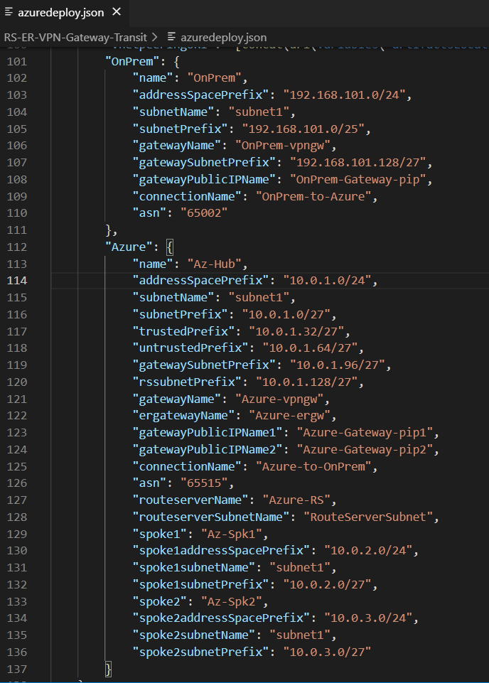

# Transit routing between ExpressRoute and VPN using Azure Route Server

**Contents**

[Concepts](#Concepts)

[Deploy this solution](#Deploy-this-solution)

[LAB steps](#LAB-steps)

[Clean up](#Clean-up)

[Acknowledgments](#Acknowledgments)

## Concepts

Azure Route Server (ARS) is a new Azure Network feature made available recently. One of its main features is to allow BGP peering between Network Virtual Appliances (NVAs) and Azure Virtual Network and consequently route exchange between them. Additionally, ARS enables transit was to allow transit between Virtual Network Gateways ExpressRoute and VPN  which before was not possible. For more information about this feature, consult [About Azure Route Server (Preview) support for ExpressRoute and Azure VPN](https://docs.microsoft.com/en-us/azure/route-server/expressroute-vpn-support).

**Note:** Azure Route Server is currently in Public Preview. Therefore, verify Azure Route Server [documentation](https://docs.microsoft.com/en-us/azure/route-server/overview) for the most current status and when it will be made generally available (GA).

Several scenarios can benefit from having ARS to allow VPN and ExpressRoute transit. For example, Azure Vmware Solutions (AVS), HANA Large Instances (HLI), Skytap, and others. Most of those solutions use ExpressRoute Connections (basically, an ExpressRoute circuit connected to an ExpressRoute Gateway) to integrate with Azure Virtual Network. Customers may have an existing VPN connection from their on-premises location to Azure and want to make sure they can access those environments via Azure. 
Another common scenario, ARS can allow customers who already have their on-premises Datacenters already connected to Azure using ExpressRoute to transit over other remote locations. For example, a customer branches via VPN (using Microsoft Network backbone as transit) or other providers or customers towards a B2B scenario.

This lab intends to help you to build a Lab environment to simulate transit between ExpressRoute and VPN by creating the environment integrally as well as emulate an on-premises environment to give you the capability to demonstrate and validate the transit functionality made possible by ARS.

### Architecture diagram

## Deploy this solution

**Note:** The template provisioning takes approximately 50-60 minutes to complete.

## Solution components

The components that you can deployed are exactly what is shown above on the Architecture Diagram:

1. **Azure Hub VNET** (10.0.1.0/24) and subnets (subnet1, trusted, untrusted, RouteServerSubnet, GatewaySubnet)
2. **Azure Spoke1** (10.0.2.0/24) and subnet1
3. **Azure Spoke2** (10.0.3.0/24) and subnet1
4. Emulated **On-premises** on Azure (192.168.101.0/24) and subnet1
5. **VPN Gateways:** Azure-VPN-Gateway and Onprem-VPN-Gateway with VPN connection and BGP (Azure AS: 65515 and Onprem AS: 65002). Note that this solution uses BGP but that transit is also allowed when VPN is using static tunnels.
6. **ExpressRoute Gateway:** Azure-ergw and connection to specified ExpressRoute ResourceID.
7. **Azure Route Server** with *branch to branch enabled* to allow transit between ExpressRoute gateways and VPN Gateway.
8. Virtual Machines provisioned: **Az-Hub-lxvm** (10.0.1.4), **Az-Spk1-lxvm** (10.0.2.4), **Az-Spk2-lxvm** (10.0.3.4) and **OnPrem-lxvm** (192.168.101.4).

## LAB steps

### Parameters example

### Consideration about address spaces

You can change all the address spaces of all networks by editing the ARM template under variables and change the address space of all environments as you wish. Below is a screenshot of the ARM template section you can make the desired changes you need:

### Review Routes

- **Azure VPN Gateway** use [Portal](https://docs.microsoft.com/en-us/azure/vpn-gateway/bgp-diagnostics), PowerShell or CLI.
- **Azure ExpressRoute Gateway** PowerShell script or CLI. You can find a PowerShell script where you can dump BGP routes for both VPN and ExpressRoute Gateways, consult: [Verify BGP information on Azure VPN and ExpressRoute Gateways](https://github.com/dmauser/Lab/tree/master/VNG-BGP-Info).
- **Azure Route Server** by using CLI: _[az network routeserver peering list-advertised-routes](https://docs.microsoft.com/en-us/cli/azure/network/routeserver/peering?view=azure-cli-latest#az-network-routeserver-peering-list-advertised-routes)_ and _[az network routeserver peering list-learned-routes](https://docs.microsoft.com/en-us/cli/azure/network/routeserver/peering?view=azure-cli-latest#az_network_routeserver_peering_list_learned_routes)_

## Clean up

1. Delete Route Server using [Preview Portal](http://aka.ms/routeserver)
2. Delete Resource Group where your resource got provisioned.

## Acknowledgments

Special thanks to (Heather Sze)[https://github.com/hsze/] for validating this lab and the Networking GBB team for their insights.
