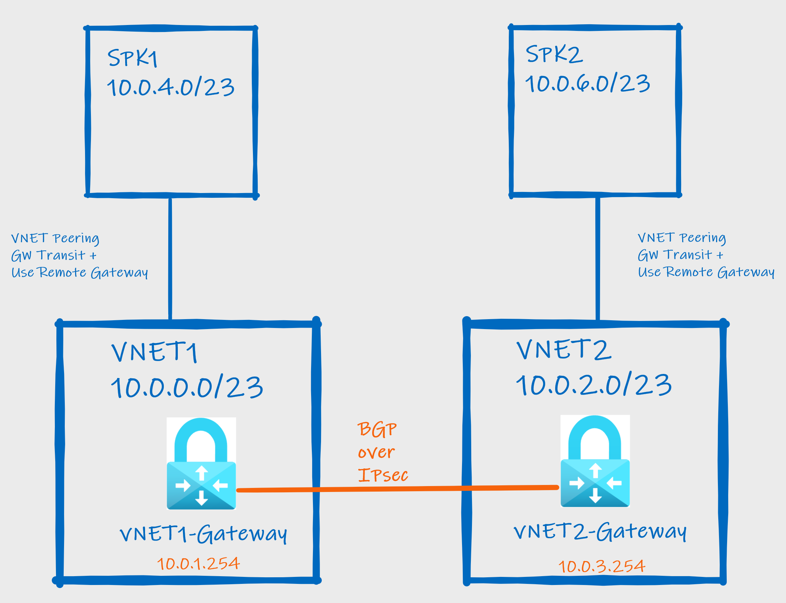
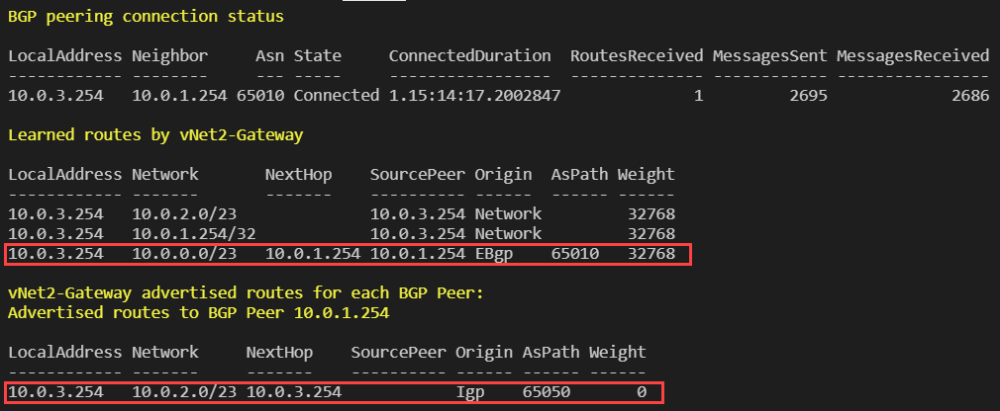
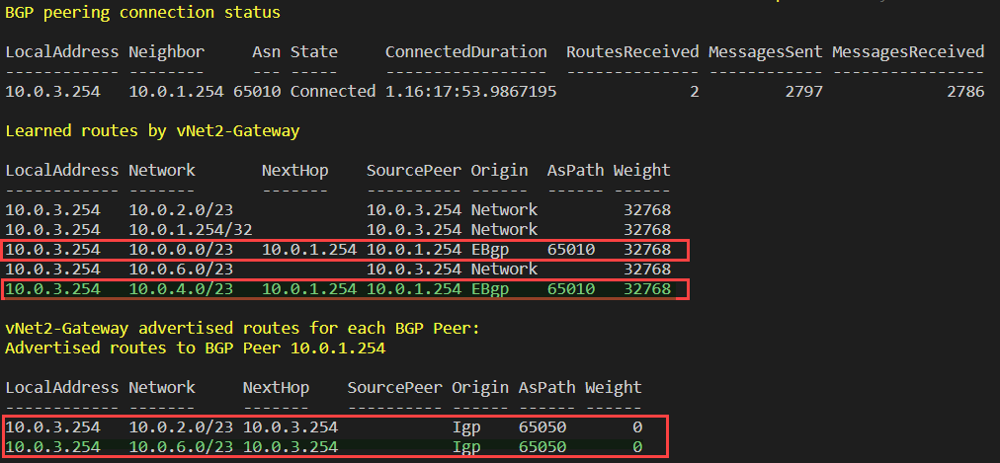

# Verify BGP information on Azure VPN and ExpressRoute Gateways

## Introduction

This is simple script that dump all BGP routing information for VPN or ExpressRoute Virtual Network Gateways (VNGs). Please note, this script is not applicable for Virtual WAN VPN or ExpressRoute Gateways.

## Known issues

1) **ExpressRoute Gateway** - This script is unable to retrieve learned routes from ExpressRoute Gateways but it is capable to dump BGP peering status and advertised routes. There's a current support ticket open investigating this issue.
2) **VPN Gateway** - On Active-Active setups and Point to Site (P2S) enabled it takes a long time to dump BGP peers. No current workaround other them disable temporary P2S configuration.

## Script

Script is available inside the repository as VNG-BGP-Info.ps1 or save the content listed below. It only works as saved as script because it requires you to specify parameters before running it.

### Pre-requisites

Ensure your are properly logged in your subscription where VNGs are present. You can validate that by using:

```powershell
Add-AzAccount #Logon on your Azure
Get-AzContext # Check you have correct Azure Subscription
Set-AzContext -Subscription <Subscription Name> # Set appropriate Subscription
```

### Content

```PowerShell
#List All Virtual Network Gateways for current Subscription
#BGP Routing info for Virtual Network Gateway (ExpressRoute or VPN)

Param(
    [Parameter(Mandatory=$true,
    HelpMessage="Add ExpressRoute or VPN Gateway Name")]
    [String]
    $GatewayName,

    [Parameter(Mandatory=$true,
    HelpMessage="Add Resource Group ExpressRoute or VPN Virtual Network Gateway")]
    [String]
    $ResourceGroupName
)

# Shows Peer Connections State, Routes Received, BGP Messages send and received
Write-Host "BGP peering connection status" -ForegroundColor Yellow
$Peerinfo = Get-AzVirtualNetworkGatewayBGPPeerStatus -ResourceGroupName $ResourceGroupName  -VirtualNetworkGatewayName $GatewayName
$Peerinfo | Format-Table

#Shows all routes learned by VNG
Write-Host "Learned routes by" $GatewayName -ForegroundColor Yellow
Get-AzVirtualNetworkGatewayLearnedRoute -ResourceGroupName $ResourceGroupName -VirtualNetworkGatewayName $GatewayName | Format-Table

#Shows all routes advertised by VNG
$ValidPeerInfo = $Peerinfo | Where-Object State -Like "Connected"
Write-Host $GatewayName "advertised routes for each BGP Peer:"  -ForegroundColor Yellow

foreach ($Peer in $ValidPeerinfo.Neighbor) {
    Write-Host "Advertised routes to BGP Peer" $Peer -ForegroundColor Yellow
    Get-AzVirtualNetworkGatewayAdvertisedRoute -ResourceGroupName $ResourceGroupName -VirtualNetworkGatewayName $GatewayName -peer $Peer | Format-Table
}
```

### Usage

Save content above as powershell script file .ps1 (example: VNG-BGP-Info.ps1) and specify required parameters -GatewayName with VNG Name and -ResourceGroupName with respective VNG's resource group name. Run the command:

*VNG-BGP-Info.ps1 -GatewayName VNGName -ResourceGroupName RGName*

## LAB

In this lab you are going to create two Azure Virtual Network Gateways (VNGs) and configure a Site-to-Site VPN connection and BGP. You will use VNG-BGP-Info.ps1 script to dump BGP configuration information. See a diagram of this LAB environment as shown:



1. Deploy template two Azure VPN Gateways with BGP using this ARM template [VNET to VNET connection](https://github.com/Azure/azure-quickstart-templates/tree/master/201-vnet-to-vnet-bgp). Please note, this template creates two VNGs and interconnect VNET1 (10.0.0.0/23)  and VNET2 (10.0.2.0/23) using S2S VPN connection. Please note, this template only creates VNET1 and VNET2 and Spoke VNETs are created on step 3.
2. Run the script VNG-BGP-Info.ps1 against both VNG Gateways to get information about BGP Peering. Example command and output:
**VNET1-Gateway side**: *VNG-BGP-Info.ps1 -GatewayName vNet1-Gateway -ResourceGroupName VNG-BGP-LAB*
**Output** below shows 10.0.2.0/23 as learned route from peer peer 10.2.0.254 (AS 65050) and 10.0.0.0/23 as advertised route.

**VNET2-Gateway side**: *VNG-BGP-Info.ps1 -GatewayName vNet2-Gateway -ResourceGroupName VNG-BGP-LAB*
**Output** shows 10.0.0.0/23 as learned route from peer peer 10.1.0.254 (AS 65010) and 10.0.2.0/23 as advertised route.


3. Create a new Spoke VNET (SPK1-VNET) and peer it with vNET1 to show its address space propagating to the other side via BGP. When creating peering between Spoke and VNET! make sure to check **Use Gateway Transit** on VNET1 and **Use Remote Gateways** on Spoke. Repeat same process and create a new Spoke (SPK2-VNET) to VNET2. Set address space 10.0.4.0/23 to SPK1-VNET and 10.0.6.0/23 to SPK2-VNET. Re-run same commands of step 2 and you will see newer peered VNETs address space showing (green highlight):
**VNET1-Gateway side**

**VNET2-Gateway side**

4. (Optional) - Create virtual machines on each VNET and test connectivity.
5. (Optional/Advanced) - Make both VNGs as active-active, create a secondary VPN connection and reconfigure BGP peerings.
