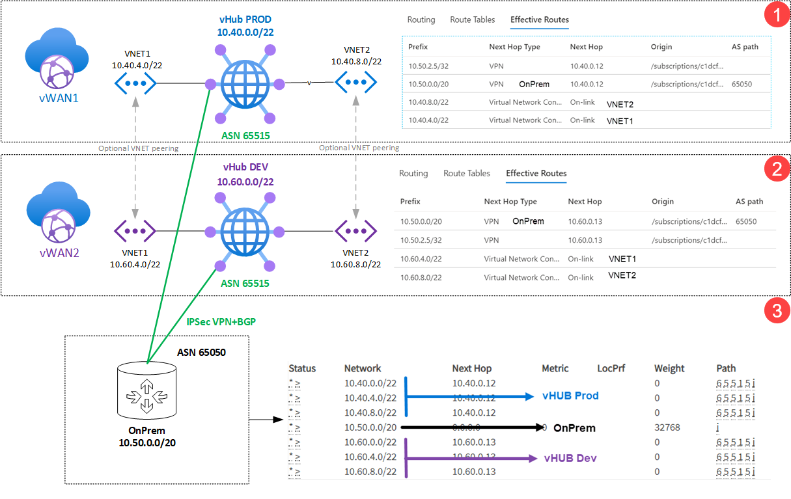
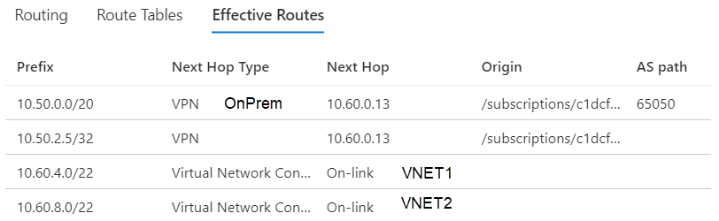

# Multiple Virtual WANs (Prod and Dev)

## Introduction

This a scenario where customer requires a fully separated traffic between Production (Prod) and Development (Dev) environments but wants to keep connectivity to On-premises to both environments. That is possible by creating two fully separated Virtual WANs (vWANs).

One of the challenges customer may raise on this scenario is the fact when connecting to Virtual WAN Hub (vHUB) there's a fix ASN 65515 and could we accomplish that isolation between both vWANs.

>It is important to highlight that using vWAN custom routing feature customers can also for more information on those VNET isolated scenario and that may suitable for your scenario. Please check the following link for more information: [Scenario: Custom isolation for VNets](https://docs.microsoft.com/en-us/azure/virtual-wan/scenario-isolate-vnets-custom)

## Scenario and routing outcome

From a routing perspective as shown on the previous section, routes from each vWAN (1 and 2) will propagate down to On-Prem but because they use the same ASN. On-Prem VPN Device will not propagate back network address spaces to the other connected vWAN, because both vWAN use the same ASN, due BGP by design behavior, routes will not be propagated via On-Prem VPN device (no transitivity).

Expanding on the routing behavior showing above:

1) vWAN1 (Prod) route table shows routes from vHUB connected VNETs and On-Prem (It does not show routes from vWAN2, which is expected)

    

2) vWAN2 (Dev) route table shows routes from vHUB connected VNETs and On-Prem (It does not show routes from vWAN2, which is expected)

    

3) On-Prem route table shows routes from both vWANs (1 and 2). It is not transitive because vWAN1 and VWAN2 the share same ASN. Therefore, On-Prem workloads can reach each one of the vWAN environments but vWAN don't "talk" to each other meeting customer's requirement.

    

## Connectivity between v-WANs

In case of temporary or permanent connectivity (represented on diagram by Optional VNET peering) is needed between both environments a traditional VNET peering can be done between VNETs located in different vWAN environments.

>**Note:** VNET peering is not transitive and routes will not get propagated because will not be possible to check "Use Remote Gateway" for that VNET interconnection vWAN scenario.

Another potential solution for full transitivity between vWAN is to use Cisco AS Override feature which works like "NAT" for ASNs, allowing communication and route exchange between two environments using the same ASN but having a Cisco device doing ASN Override to a different ASN number. (That can be a scope for another article).

A third option would be creating a Site to Site VPN between two vWANs using static routing. That option is explained in details on: [Connect two Virtual WANs to each other over VPN](https://blog.cloudtrooper.net/2020/07/03/connect-two-virtual-wans-to-each-other-over-vpn/).

## Conclusion

At this time is not possible to customize vWAN ASN to other value than 65515. However, for this type of customer requirement to separate Dev and Prod a different ASN is not required, and  security requirement has been met by having both environment fully isolated, leaving only On-Premises with ability to reach both of them. Also, In case customer needs some kind of temporary connectivity, they can peer VNETs between both two environments.