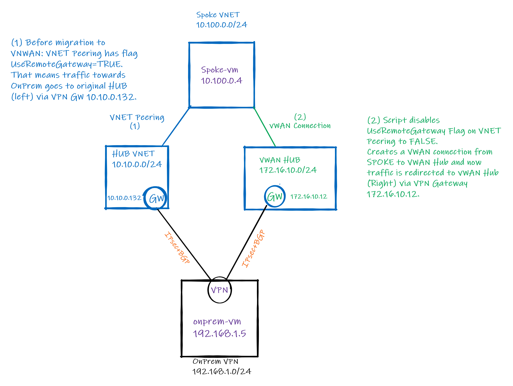

# Migrating Spoke VNET to Azure Virtual WAN Hub

## Contents
[Concepts](#Concepts)

[Sample script](#Samplescript)

[Lab](#Lab)

## Concepts

For customers transitioning from traditional Hub/Spoke to Azure Virtual WAN (vWAN) the script below helps you to automate the migration process to move a Spoke VNET from traditional Hub to vWAN Hub. Below are important points  to consider:

1. First, the script does not remove original peering from Hub but disables **UseRemoteGateway flag to false**. This allows potential dependencies from Spoke VNET to the original Hub to be kept and gives some room to customers to roll back in case the connection to On-premises via vWAN Hub does not work as expected. Also, original peering to traditional the Hub is kept in case there are shared services being used such as DNS and Active Directory domain controllers.
2. Second, the script creates a **VNET connection to vWAN Hub**, and the expectation is the traffic flow to On-premises goes over vWAN Hub. During the lab (see below) using BGP+IPSec the traffic transition took around 20-30 seconds.
3. Third (optional) in case traffic does not flow via vWAN to On-premises as expected customer can run the third part of the script to roll back the configuration. The script deletes the VNET connection to vHUB and changes back to the original VNET peering by setting **UseRemoteGateway flag to true**.
4. Keep in mind this script is very simplistic and you may need to account for other dependencies that need to be mapped during the Spoke VNET transition between traditional Hub to vWAN Hub.
5. Although this lab covers BGP over IPSec Tunnels from On-premises to Traditional Hub and vWAN Hub, the **same idea works for ExpressRoute connectivity** to either both Hubs (traditional and vWAN) or a mix of ExpressRoute with BGP+IPSec tunnels to either one of the Hubs. **Please note** that IPSec VPN with static routing requires changes on On-Premises VPN devices to make the  transition.



## Sample script

**Prerequisites**

```bash
az extension add --name virtual-wan 
# or update
az extension update --name virtual-wan
```

**Define Variables** (Resource Groups, SpokeVNET, VWANHUB, VWAN VNET Connnection Name)
```Bash
# SpokeVNET variables – replace <> below with your values.
spkrg=<resource group name>
spkvnetname=$spoke1name-vnet #Spoke VNET Name
vnetid=$(az network vnet show -g $spkrg -n $spoke1name-vnet --query id --out tsv) #Spoke VNET ResourceID to be migrated to vWAN and used in step 3.
spkpeeringname=<peering name> #Name of current peering using UseRemoteGateways=True that is connected to original HUB.
# vWAN HUB variables - replace below with your values.
vwanrg=<vWAN resource group name> #vWAN Hub Resource Group Name
vhubname=<vWAN Hub Name> # Replace with your vWAN Hub Name
```

Run steps below 1 and 2 to connect Spoke VNET to vWAN by keeping original VNET peering to traditional Hub.

1. Set UseRemoteGateways flag to false 
```Bash
az network vnet peering update -g $spkrg -n $spkpeeringname --vnet-name $spkvnetname --set UseRemoteGateways=False
```

2. Configure VWAN HUB Virtual Network Connection

```Bash
#Note: For simplification of the process $spkvnetname is used as connection Name for vhubname. If you need specify a new name just add a new variable for that.
az network vhub connection create -g $vwanrg -n $spkvnetname --vhub-name $vhubname --remote-vnet $vnetid
```

**Migration completes here**

3. (Optional) Rolling back the original config. It removes vHUB VNET Connection and re-enables original peering to UseRemoteGateways to true.
**NOTE**: Use only if previous steps did not work and you want to revert traffic back to original HUB.

```Bash
az network vhub connection delete -g $vwanrg -n $spkvnetname --vhub-name $vhubname --yes
az network vnet peering update -g $spkrg -n $spkpeeringname --vnet-name $spkvnetname --set UseRemoteGateways=True
```

## Lab

```bash
# Variables
rg=vwan-migrate-lab
location=southcentralus
sharedkey=Msft123Msft123
mypip=$(curl ifconfig.io -s) # or replace with your home public ip, example mypip="1.1.1.1" (required for Cloud Shell deployments
#Define username and password variables
username=azureadmin  #replace with your values
password=Msft123Msft123 #replace with your values

##Azure Hub
hubname="Hub"
hubvnetcidr="10.10.0.0/24"
hubinternalcidr="10.10.0.0/25"
hubGatewaySubnet="10.10.0.128/27"

##Azure Spoke
spoke1name="Spoke"
spoke1cird="10.100.0.0/24"
spoke1vmsubnet="10.100.0.0/25"

##On-prem
onpremname=onprem
onpremvnetcird="192.168.0.0/23"
onpreminternalcidr="192.168.1.0/24"
onpremexternalcidr="192.168.0.0/29"
onpremasn="65001"
onprembgpaddr="169.254.21.1"

##vWAN
vhubname=scus-vhub
vwan=vwan
vwan_hub1_prefix=172.16.10.0/24

# Start: create RT

#Create VNETs and Subnets
#Build Networks Hub and Spoke Networks
# HUB VNET
az group create --name $rg --location $location --output none
az network vnet create --resource-group $rg --name $hubname-vnet --location $location --address-prefixes $hubvnetcidr --subnet-name internal --subnet-prefix $hubinternalcidr  --output none
az network vnet subnet create --address-prefix $hubGatewaySubnet --name GatewaySubnet --resource-group $rg --vnet-name $hubname-vnet --output none
#Spoke VNET
az network vnet create --resource-group $rg --name $spoke1name-vnet --location $location --address-prefixes $spoke1cird --subnet-name vmsubnet --subnet-prefix $spoke1vmsubnet --output none
#Simulated On-premises
az network vnet create --resource-group $rg --name $onpremname-vnet --location $location --address-prefixes $onpremvnetcird --subnet-name external --subnet-prefix $onpremexternalcidr --output none
az network vnet subnet create --address-prefix $onpreminternalcidr --name internal --resource-group $rg --vnet-name $onpremname-vnet --output none

# vwan and hubs
az network vwan create -n $vwan -g $rg -l $location --branch-to-branch-traffic true --type Standard
az network vhub create -n $vhubname -g $rg --vwan $vwan -l $location --address-prefix $vwan_hub1_prefix --no-wait

#(Optional) UDR to restrict SSH access to Azure VMs from your Public IP only:
az network nsg create --resource-group $rg --name nsg-restrict-ssh --location $location
az network nsg rule create \
    --resource-group $rg \
    --nsg-name nsg-restrict-ssh \
    --name AllowSSHRule \
    --direction Inbound \
    --priority 100 \
    --source-address-prefixes $mypip/32 \
    --source-port-ranges '*' \
    --destination-address-prefixes '*' \
    --destination-port-ranges 22 \
    --access Allow \
    --protocol Tcp \
    --description "Allow inbound SSH"
az network vnet subnet update --name internal --resource-group $rg --vnet-name $hubname-vnet --network-security-group nsg-restrict-ssh
az network vnet subnet update --name vmsubnet --resource-group $rg --vnet-name $spoke1name-vnet --network-security-group nsg-restrict-ssh
az network vnet subnet update --name internal --resource-group $rg --vnet-name $onpremname-vnet --network-security-group nsg-restrict-ssh

#Create Active-Acive VPN Gateway
az deployment group create --name $hubname-vpngw --resource-group $rg \
--template-uri https://raw.githubusercontent.com/dmauser/Lab/master/VNG-APIPA/vng-apipa.json \
--parameters gatewayName=$hubname-vpngw gatewaySku=VpnGw1 vnetName=$hubname-vnet asn=65002 \
--no-wait

#Deploy OPNSense On-Premises
az deployment group create --name $onpremname-nva --resource-group $rg \
--template-uri "https://raw.githubusercontent.com/dmauser/opnazure/master/azuredeploy-TwoNICs.json" \
--parameters virtualMachineSize=Standard_B2s virtualMachineName=$onpremname-nva TempUsername=azureuser TempPassword=Msft123Msft123 existingVirtualNetworkName=$onpremname-vnet existingUntrustedSubnet=external existingTrustedSubnet=internal PublicIPAddressSku=Standard \
--no-wait

#Create vWAN VPN gateway
az network vpn-gateway create -n $vhubname-vpn1 -g $rg -l $location --vhub $vhubname --asn 65515 --no-wait

#Deploy Azure VMs on Spoke VNETs and On-Premises

# Deploy VMs
#SpokeVM
az network public-ip create --name $spoke1name-vm-pip --resource-group $rg --location $location --allocation-method Dynamic
az network nic create --resource-group $rg -n $spoke1name-vm-nic --location $location --subnet vmsubnet --vnet-name $spoke1name-vnet --public-ip-address $spoke1name-vm-pip 
az vm create -n $spoke1name-vm -g $rg --image UbuntuLTS --size Standard_B1s --admin-username $username --admin-password $password --nics $spoke1name-vm-nic --location $location
#Add NGIX on Spoke VM
az vm extension set \
  --resource-group $rg \
  --vm-name $spoke1name-vm \
  --name customScript \
  --publisher Microsoft.Azure.Extensions \
  --protected-settings '{"commandToExecute": "apt-get -y update && apt-get -y install nginx && apt-get install inetutils-traceroute"}' \
  --no-wait

#On-premVM
az network public-ip create --name $onpremname-vm-pip --resource-group $rg --location $location --allocation-method Dynamic
az network nic create --resource-group $rg -n $onpremname-vm-nic --location $location --subnet internal --vnet-name $onpremname-vnet --public-ip-address $onpremname-vm-pip 
az vm create -n $onpremname-vm -g $rg --image UbuntuLTS --size Standard_B1s --admin-username $username --admin-password $password --nics $onpremname-vm-nic --no-wait --location $location

#UDR On-prem VM:
# Onprem-vm
az network route-table create --name rt-$onpremname --resource-group $rg --location $location
az network route-table route create --resource-group $rg --name default-to-nvalb --route-table-name rt-$onpremname \
--address-prefix 0.0.0.0/0 \
--next-hop-type VirtualAppliance \
--next-hop-ip-address $(az network nic show -g $rg --name $onpremname-nva-Trusted-NIC --query "ipConfigurations[].privateIpAddress" -o tsv)
az network route-table route create --resource-group $rg --name Exception --route-table-name rt-$onpremname \
--address-prefix $mypip/32 \
--next-hop-type Internet
az network vnet subnet update -n internal -g $rg --vnet-name $onpremname-vnet --route-table rt-$onpremname

#Create VNET Peerings between HUB and Spoke
# Hub to Spoke1 (UseRemoteGateways and Transit enabled)
az network vnet peering create -g $rg -n $hubname-to-$spoke1name --vnet-name $hubname-vnet --allow-vnet-access --allow-forwarded-traffic --allow-gateway-transit  --remote-vnet $(az network vnet show -g $rg -n $spoke1name-vnet --query id --out tsv) --output none
az network vnet peering create -g $rg -n $spoke1name-to-$hubname --vnet-name $spoke1name-vnet --allow-vnet-access --allow-forwarded-traffic --use-remote-gateways --remote-vnet $(az network vnet show -g $rg -n $hubname-vnet  --query id --out tsv) --output none


# Create Local Network Gateway with OnPrem info
az network local-gateway create --gateway-ip-address $(az network public-ip show --name $onpremname-nva-PublicIP --resource-group $rg -o tsv --query "ipAddress" -o tsv) \
--name lng-$onpremname \
--resource-group $rg \
--asn $onpremasn \
--bgp-peering-address $onprembgpaddr

# Create VPN Connection from Hub VPN Gateway to On-premises NVA
az network vpn-connection create --name to-$onpremname \
--resource-group $rg \
--vnet-gateway1 $hubname-vpngw \
 -l $location \
--shared-key $sharedkey \
--local-gateway2 lng-$onpremname \
--enable-bgp

# Because APIPA making Azure-Gateway Responder only
az network vpn-connection update --name to-$onpremname \
    --resource-group $rg \
    --set connectionMode=ResponderOnly

# VWAN VPN Connection to On-Premises
onprep_nva_pip=$(az network public-ip show --name $onpremname-nva-PublicIP --resource-group $rg -o tsv --query "ipAddress" -o tsv)
az network vpn-site create -n $onpremname -g $rg -l $location --virtual-wan $vwan \
    --asn $onpremasn --bgp-peering-address $onprembgpaddr --ip-address $onprep_nva_pip \
    --device-vendor OPNsense --device-model BSD --link-speed 100
az network vpn-gateway connection create -n to-$onpremname --gateway-name $vhubname-vpn1 -g $rg --remote-vpn-site $onpremname \
    --enable-bgp true --protocol-type IKEv2 --shared-key "$sharedkey" --connection-bandwidth 100 

# Connfigure VNWA APIPA (manually on Portal need to get CLI/ARM script)
# vwan: scus-vhub: VPN (Site to site): View/Configure 
# VPN Gateway Instance 0
# Custom BGP IP Address: 169.254.21.6
# VPN Gateway Instance 0
# Custom BGP IP Address: 169.254.21.8

# Configure OPNSense
# System: Firmware: Plugins: os-frr
## Create Tunnel to Azure VPN Gateway (Single Tunnel).
# Get Azure VPN Gateway Public IPs:
az network public-ip show --name $hubname-vpngw-pip1 --resource-group $rg -o tsv --query "ipAddress" -o tsv
# Optional second tunnel
az network public-ip show --name $hubname-vpngw-pip2 --resource-group $rg -o tsv --query "ipAddress" -o tsv

# VPN: IPsec: Tunnel Settings
# Remote gateway 13.84.38.128
# My identifier: Ip Address: 20.88.198.77
az network public-ip show -g $rg -n Hub-vpngw-pip1 --query ipAddress -o tsv
# Pre-Shared Key: Msft123Msft123
# Encryption algorithm: AES:128
# Hash algorithm: SHA256
#  DH key group: 2
# Lifetime: 28800
# Install policy: Unchcked (very important)
# Add phase II entry
# Mode: Route-based
# Local Address: 169.254.21.1
# Remote Address: 169.254.21.4
# Encryption algorithms: AES checked
#                  Uncheck: Blowfish, 3DES, CAST128
# Hash algorithms: SHA256   
#  PFS key group: off    
#  Lifetime: 27000               

## Create Tunnel to Virtual WAN
# Get Azure VPN Gateway Public IPs:
az network vpn-gateway show -n $vhubname-vpn1 -g $rg --query bgpSettings.bgpPeeringAddresses[0].tunnelIpAddresses[0] -o tsv
# Optional second tunnel
az network vpn-gateway show -n $vhubname-vpn1 -g $rg --query bgpSettings.bgpPeeringAddresses[1].tunnelIpAddresses[0] -o tsv

# VPN: IPsec: Tunnel Settings
# Remote gateway 52.249.58.13
# My identifier: Ip Address: 20.88.198.77
az network public-ip show --name $onpremname-nva-PublicIP --resource-group $rg -o tsv --query "ipAddress" -o tsv
# Pre-Shared Key: Msft123Msft123
# Encryption algorithm: AES:128
# Hash algorithm: SHA256
#  DH key group: 2
# Lifetime: 28800
# Install policy: Unchcked (very important)
# Add phase II entry
# Mode: Route-based
# Local Address: 169.254.21.1
# Remote Address: 169.254.21.6
# Encryption algorithms: AES checked
#                  Uncheck: Blowfish, 3DES, CAST128
# Hash algorithms: SHA256   
#  PFS key group: off    
#  Lifetime: 27000

# Enable IPSec and hit save

# Firewall Rules: IPSec
# Add +  Save + Apply Changes

# Routing: General: Enable Checked

# Routing: BGP: Genreral Enable Checked
# BGP AS Number: 65001
# Network: 192.168.1.0/24

# Routing: BGP: Neighbor: 
# Enable Checked
# Peer-IP: 169.254.21.2
# Remote AS: 65002

# Routing: BGP: Neighbor: 
# Enable Checked
# Peer-IP: 169.254.21.6
# Remote AS: 65515

# Access VMs using SSH:

# Validations

#IP info
az network nic show --resource-group $rg -n $spoke1name-vm-nic --query "ipConfigurations[].privateIpAddress" -o tsv
az network nic show-effective-route-table --resource-group $rg -n $spoke1name-vm-nic -o table

az network nic show --resource-group $rg -n $onpremname-vm-nic --query "ipConfigurations[].privateIpAddress" -o tsv
az network nic show-effective-route-table --resource-group $rg -n $onpremname-vm-nic -o table

#VMs Public IPs
echo Spoke-vm - $(az network public-ip show --name $spoke1name-vm-pip --resource-group $rg -o tsv --query "ipAddress" -o tsv) \
$onpremname-vm - $(az network public-ip show --name $onpremname-vm-pip --resource-group $rg -o tsv --query "ipAddress" -o tsv) \
$onpremname-nva - $(az network public-ip show --name $onpremname-NVA-PublicIP --resource-group $rg -o tsv --query "ipAddress" -o tsv)

#### MIGRATION ###

# Pre-Requisite
az extension add --name virtual-wan 
# or update
az extension update --name virtual-wan

# 1) Define Variables (Resource Groups, SpokeVNET, VWANHUB, VWAN VNET Connnection Name)
# SpokeVNET variables – replace below with your values.
spkrg=$rg
spkvnetname=$spoke1name-vnet #Spoke VNET Name
vnetid=$(az network vnet show -g $rg -n $spoke1name-vnet --query id --out tsv) #Spoke VNET ResourceID to be migrated to vWAN and used in step 3.
spkpeeringname=Spoke-to-Hub #Name of current peering using UseRemoteGateways=True that is connected to original HUB.
# vWAN HUB variables - replace below with your values.
vwanrg=$rg #vWAN Hub Resource Group Name
vhubname=$vhubname #vWAN Hub Name

# 2) Set UseRemoteGateways Gateways to false 
az network vnet peering update -g $spkrg -n $spkpeeringname --vnet-name $spkvnetname --set UseRemoteGateways=False

# 3) Configure VWAN HUB Virtual Network Connection.
#Note: For simplification of the process $spkvnetname is used as connection Name for vhub. If you need specify a new name just add a new variable for that.
az network vhub connection create -g $vwanrg -n $spkvnetname --vhub-name $vhubname --remote-vnet $vnetid

# <Migration completes here>

# Rolling back the original config (Remove vhub VNET Connection and re-enables original peering to UseRemoteGateways to true)
# ***NOTE***: Use only if previous steps did not work and you want to revert traffic back to original HUB.
az network vhub connection delete -g $vwanrg -n $spkvnetname --vhub-name $vhubname --yes
az network vnet peering update -g $spkrg -n $spkpeeringname --vnet-name $spkvnetname --set UseRemoteGateways=True
```
